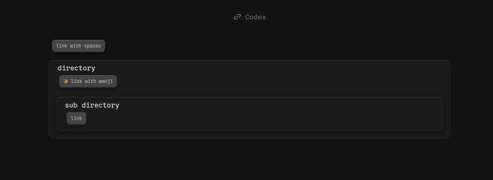

# codex : Linktree as code
codex it's a linktree as code allowing you to build your own link organization, managing images, emojies, directory, etc.

# Get started
## Set-up
#### 1 clone this
#### 2 add this function in your `.bashrc`, `.zshrc...`
```
codex{
  bash {path/to/the/codex/dir}/codex.sh $@
}
```

## Create your links
Edit the `codex.yaml` to create your sctructure following this exemple:
```yaml
LINKS:
  link with spaces: https://
  directory:
    ✨ link with emoji: https://
    sub directory:
        link: https://
```
> root key must be `LINKS`

## build
run `codex build` will build your `codex.html`
Opening the `codex.html` will give :


## edit codex.yaml
to avoid having to remember the path to the `codex.yaml` file, the `codex path` command gives the link to the file.

for exemple :
```bash
vim $(codex path)  #edit with vim
code $(codex path) #edit with vscode
```
