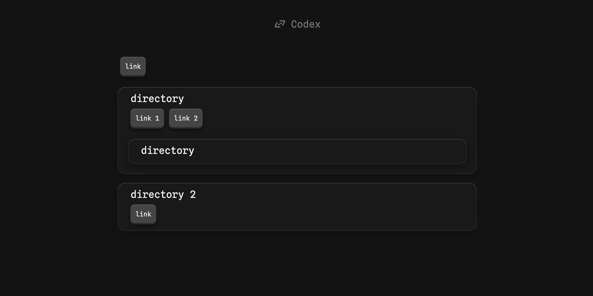

# codex : Linktree as code
Codex, it's built to be usable as it is. No need to build, run script etc.

# Get started
## Set-up
- create dir named `codex`
- add a `codex.yaml`
- add a `codex.html`
- copy/past following in `codex.html` :
```html
<!DOCTYPE html>
<html lang="en">
<head>
    <meta charset="UTF-8">
    <meta name="viewport" content="width=device-width, initial-scale=1.0">
    <link rel="preconnect" href="https://fonts.googleapis.com">
    <link rel="preconnect" href="https://fonts.gstatic.com" crossorigin>
    <link href="https://fonts.googleapis.com/css2?family=Spline+Sans+Mono:wght@300..700&display=swap" rel="stylesheet">
    <link rel="icon" type="image/x-icon" href="https://cdn.jsdelivr.net/gh/eloi-menaud/codex/fav.ico">
    <link rel="stylesheet" href="https://cdn.jsdelivr.net/gh/eloi-menaud/codex/index.css">
    <title>Codex</title>
</head>
<body>
    <div><h1>Codex</h1></div>
    <main id="main"></main>
    <script src="https://cdn.jsdelivr.net/gh/eloi-menaud/codex/index.js"></script>
    <script src="https://cdn.jsdelivr.net/gh/nodeca/js-yaml/dist/js-yaml.min.js"></script>
</body>
</html>
```
## Use it
Edit the `codex.yaml` to create your sctructure following this exemple:
```yaml
LINKS:
  'a root link': https://
  'first directory':
    'a link in directory': https://
    'a sub directory':
      'a link in sub directory': https://
  'second directory':
    'a link in directory': https://
```
> root key must be `LINKS`

Opening the `codex.html` will give :


